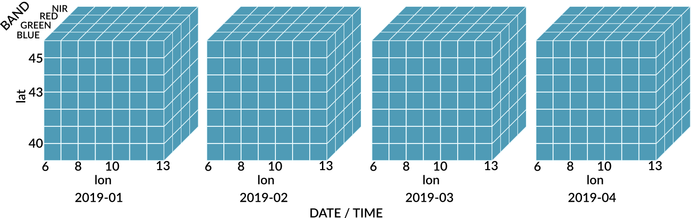

```{r setup, include=FALSE}
figtrim <- function(path) {
  img <- magick::image_trim(magick::image_read(path))
  #img <- magick::image_extent(img,magick::geometry_size_percent(width = 100, height = 110))
  magick::image_write(img, path)
  path
}
knitr::opts_chunk$set(echo = TRUE)
#knitr::opts_chunk$set(eval = FALSE)
knitr::opts_chunk$set(out.width = "100%")
knitr::opts_chunk$set(dev = "jpeg")
knitr::opts_chunk$set(fig.process = figtrim)
knitr::opts_chunk$set(fig.width = 10, fig.height = 10)
```

**OpenGeoHub Summer School 2020, Wageningen**


# Outline


- **Part I: Introduction to Earth observation (EO) data cubes and the `gdalcubes` R package**

- Part II: Examples on using data cubes to combine imagery from different satellite-based EO missions

- Part III: Summary, discussion, and practical exercises


All the material of this tutorial is online at [GitHub](https://github.com/appelmar/opengeohub_summerschool2020), including R markdown sources, rendered HTML output, and solutions to the practical exercises. 


# Sample Data

Part I will use a collection of 180 Landsat 8 surface reflectance images, covering a small part of the Brazilian Amazon forest. The live demonstration will use the full resolution dataset (62 gigabytes compressed; > 200 gigabytes unzipped; available [here](https://uni-muenster.sciebo.de/s/SmiqWcCCeFSwfuY/download)), whereas we will use a downsampled version of the same dataset with coarse spatial resolution (300 meter pixel size; 740 megabytes compressed; 2 gigabytes unzipped) in the practical part (available [here](https://uni-muenster.sciebo.de/s/e5yUZmYGX0bo4u9/download)). 

After downloading whichever version of the dataset, make sure to unzip it. The following R code will download the low resolution version to your current working directory and unzip it.

```{r download, eval = FALSE}
download.file("https://uni-muenster.sciebo.de/s/e5yUZmYGX0bo4u9/download", 
              destfile = "L8_Amazon.zip", mode="wb")
unzip("L8_Amazon.zip", exdir = "L8_Amazon")
```


---------------------------------------------------------------------------------------------------------------------------


# Part I: Introduction to the gdalcubes R package

Raw satellite imagery is mostly distributed as collection of files, whether on download portals of space agencies, or in cloud computing environments (Amazon Web Services, Google Cloud, ...). If we want to analyze more than a single image, or even images from multiple satellites, we quickly run into the following challenges: 

- spectral bands at different spatial resolutions 
- spatially overlapping images
- irregular time series for pixels from different tiles (or in overlapping areas)
- different spatial reference systems of images
- different data formats and structures

To do time series analysis, process larger areas, and / or combine datasets from different sensors / satellites, we first must restructure our data, e.g. as a data cube with a single spatial reference system, regular pixel sizes, both in time and in space.



Notice that what we call *cube* is actually not really a cube. It has (up to) four dimensions, and the lengths of the dimensions may be different.
Therefore, four dimensional regular raster data cubes also cover simple time series, multiband time series, grayscale images, multispectral images, and time-series of images.


## Existing tools (with a focus on R)

[GDAL](https://gdal.org), the Geospatial Data Abstraction Library is a software library reading and writing all relevant raster (and vector) data formats, and providing functions to warp (reproject, rescale, resample, and crop) multiband raster images. It has a three dimensional (space, bands) raster data model and solves some of the problems (data formats, image warping). However, it does *not* know about the organization of data products, and time. GDAL is written in C / C++ but the `rgdal`package [@rgdal] provides an easy to use interface in R.

There are further R packages to process satellite imagery:

`raster`[@raster]

- well established, stable, reliable
- three-dimensional only, no multispectral AND multitemporal stacks
- chaining operations on rasters (stacks / bricks) always writes intermediate results to disk
- works on full resolution data, requires additional steps e.g. to try out things on lower resolution
- modern version `terra` [@terra] recently published on CRAN (see https://cran.r-project.org/package=terra)


`stars` [@stars] 

- arbitrary dimensions
- assumes a data cube as input (does not do spatial mosaicing, temporal aggregation)
- has vector data cubes
- lazy evaluation approach, compute only the pixels you see.


## First steps

gdalcubes is a quite new C++ library and R package that mostly wraps functions of the C++ library. It uses GDAL to read, write, and warp images, but understands date/time and how complex satellite image data products are organized. We will focus on the R package here. To get started, please install the gdalcubes package from CRAN with:

```{r install, eval = FALSE}
install.packages("gdalcubes")
```

We can load the package and make sure that all computations later in this tutorial use up to 8 threads with:

```{r setup_gdalcubes}
library(gdalcubes)
gdalcubes_options(threads=8)
```

Please notice that this tutorial needs package version 0.3.0, which you can check by running:

```{r pkgversion}
packageVersion("gdalcubes")
```

## Image Collections

At first, we need to tell gdalcubes where our satellite images come from and how they are organized.

```{r L8files}
L8.files = list.files("/media/marius/Samsung_T5/eodata/L8_Amazon_full", pattern = ".tif", recursive = TRUE, full.names = TRUE) 
head(L8.files, 15)
length(L8.files)
sum(file.size(L8.files)) / 1000^3 # gigabytes
```

We see that every image is represented by a directory, with individual files for spectral bands. 
 To be able to work with these images as "one object", we must scan all the files once and extract some metadata (date/time, coordinate reference system, spatial extent, etc.). Therefore, we compile the images to an _image collection_ with the following command:

```{r L8col}
L8.col = create_image_collection(L8.files, format = "L8_SR", out_file = "L8.db")
# L8.col = image_collection("L8.db") 
L8.col
```

The result is essentially an index stored in a single file (SQLite) database, typically consuming around a few kilobytes per image. Later in the tutorial, this index e.g. allows to avoid reading image data from files which do not intersect with our spatiotemporal area of interest.

The `format` argument describes, how all the metadata can be extracted from the images. The gdalcubes package comes with a set of predefined **image collection formats** for particular data products. We can list available formats with:

```{r colformats}
collection_formats()
```

The number of available formats is still rather limited, but continues to grow and is extensible (using `add_collection_format()`). In fact, a collection format is a single JSON (JavaScript Object Notation) file, describing some rules how to extract e.g. date/time, and bands from filenames (examples at https://github.com/gdalcubes/collection_formats). Writing collection formats for your own non-standard datasets in many cases is not too difficult and documented [here](https://gdalcubes.github.io/docs/collection_formats.html).

In our example, we used the predefined format `"L8_SR"` for Landsat 8 surface reflectance data as downloaded from the [USGS portal](https://espa.cr.usgs.gov).

The creation of image collections is typically done only once. We can add images to an existing collection with  `add_images()` and we can derive the spatiotemporal extent of the collection with:

```{r L8extent}
extent(L8.col, srs="EPSG:4326")
```

Throughout the package, coordinate reference systems can be specified as strings which are understood by GDAL. This includes the "EPSG:XXXX", WKT, proj4, and other formats (see [here](https://gdal.org/doxygen/classOGRSpatialReference.html#aec3c6a49533fe457ddc763d699ff8796).


## Defining a *Data Cube View*

We can define a target data cube by its geometry, i.e., the spatiotemporal extent, the spatial reference system, the spatial size, and the temporal duration of cells. We call this a *data cube view*, i.e., the geometry of a cube without connecting it to any data.
To create a data cube view, we can use the `cube_view()` function:

```{r L8cubeview}
v.overview.500m = cube_view(srs="EPSG:3857", extent=L8.col, dx=500, dy=500, dt = "P1Y", resampling="average", aggregation="median")
v.overview.500m

v.subarea.60m = cube_view(extent=list(left=-6180000, right=-6080000, bottom=-550000, top=-450000, 
   t0="2014-01-01", t1="2018-12-31"), dt="P1Y", dx=60, dy=60, srs="EPSG:3857", 
   aggregation = "median", resampling = "average")
v.subarea.60m

v.subarea.60m.daily =  cube_view(view = v.subarea.60m, dt="P1D") 
v.subarea.60m.daily
```


Notice that the data cube view does not contain any information on bands, because it is independent from particular data products. 


## Data Cube Creation

Having defined an *image collection*, and a *data cube view*, a data cube is simply the combination of the two. We can create a data cube with the `raster_cube()` function:

```{r L8datacube}
L8.cube.overview = raster_cube(L8.col, v.overview.500m)
L8.cube.overview
L8.cube.subarea = raster_cube(L8.col, v.subarea.60m)
L8.cube.subarea
L8.cube.subarea.daily = raster_cube(L8.col, v.subarea.60m.daily)
L8.cube.subarea.daily
```

This is very cheap, simply returning *proxy* objects, but not reading any image data. The package delays the computational intensive parts as much as possible (e.g., until users call `plot()`). The returned object knows about the bands of the data product. We can use `select_bands()` to get only the spectral bands we are interested in:

```{r L8rgb}
L8.cube.overview.rgb = select_bands(L8.cube.overview, c("B02", "B03", "B04"))
L8.cube.overview.rgb
```

There are some utility functions on data cubes, including:

```{r datacubefun}
names(L8.cube.overview.rgb)
srs(L8.cube.overview.rgb)
bands(L8.cube.overview.rgb)
```


## Plotting Data Cubes

The plot function can be used to visualize data cubes. Calling `plot()` will start reading and processing the data:

For a simple RGB plot, we use the `rgb` argument to specify which bands correspond to the red, green, and blue channels, and specify the black and white points of the channels (to control contrast and brightness) in `zlim`. 


```{r L8plot1}
plot(L8.cube.overview.rgb, rgb=3:1, zlim=c(0,1500))
plot(select_bands(L8.cube.subarea, c("B02", "B03", "B04")), rgb=3:1, zlim=c(0,1500))
```


Notice that we can also plot bands individually, creating a two-dimensional plot layout of bands and time. Using `key.pos = 1`, and `col=viridis::viridis`, we plot a legend at the bottom of the plot, and use the viridis color scales (this requires the viridis package). 

```{r L8plot2}
plot(L8.cube.overview.rgb, zlim=c(0,1500), key.pos=1, col=viridis::viridis) 
```


Plotting an identical data cube twice, with different visualization arguments `zlim`, `col`, and others will not need to reprocess the data cube again. `plot()` internally writes netCDF files to a temporary directory and remembers that a specific cube is already available.

The `plot()` function also considers different types of data cubes. For example, if the number of cells in x and y direction equals one, we get a simple time series plot, as we will see later in this tutorial.


## Masking

The `raster_cube()` function supports an additional mask band, e.g., to leave out cloudy pixels when creating a data cube. 
To define a mask, we can use the `image_mask()` function. This function expects the name of the mask band as its first `band` argument. Additionally, we can either pass a vector of values that are masked (all bands set to NA if the specified mask band has one of the provided values) as the `values` argument, or give a range of mask values by passing minimum and maximum values as `min` and `max` arguments. Masks can be inverted by setting `invert = TRUE`. For bit field masks (as for MODIS data), it is possible to extract specific bits (applying a logical AND) of the band values, before comparing them to the values or range of the mask.

```{r L8masking}
L8.clear_mask = image_mask("PIXEL_QA", values=c(322, 386, 834, 898, 1346, 324, 388, 836, 900, 1348), invert = TRUE)
x = raster_cube(L8.col, v.subarea.60m, mask=L8.clear_mask) 
x = select_bands(x, c("B02","B03","B04"))
plot(x, rgb=3:1, zlim=c(0,1500))
```

## Animations

The data cube representation makes it straightforward to create animations, by plotting time slices of the cube individually, and use these plots as animation frames:

```{r L8anim1}
animate(select_bands(raster_cube(L8.col, v.subarea.60m, mask = L8.clear_mask), c("B02","B03","B04")), rgb=3:1, zlim=c(0,1300))
```


## Exporting Data Cubes

Sometimes we want to process or visualize data cubes with external software or other packages. We can export data cubes either as single netCDF files, or as a collection of (cloud-optimized) GeoTIFF files, where each time-slice of a cube will be stored as one (multiband) file.

Both, netCDF and GeoTIFF export support *compression*, and *packing* (converting double precision numeric values to smaller integer types by applying an offset and scale) to reduce the file size if needed (see documentation at `?write_ncdf`, and `?write_tif`).


```{r L8export}
write_ncdf(L8.cube.overview.rgb, tempfile(pattern = "cube", tmpdir = getwd(),fileext = ".nc"))
```


Similarly, the package includes an `st_as_stars()` function to convert data cubes to `stars` objects [@stars] and the `write_tif()`
function can be used to process (only three-dimensional) data cubes with the `raster` package [@raster]:

```{r}
x = raster::stack(
  write_tif(
    select_bands(
      raster_cube(L8.col, v.subarea.60m), "B05")))
x
```


## Data Cube Processing

The gdalcubes package comes with some built-in operations to process data cubes. The following operations produce a derived data cube from one or more input data cubes.

| Operator | Description |
|----------|------------------------------------------------------------------------------------|
| `apply_pixel` | Apply arithmetic expressions on band values per pixel.     |
| `fill_time` |   Fill missing values by simple time-series interpolation.   |
| `filter_pixel` | Filter pixels based on logical expressions.            |
| `filter_geom` | Filter pixels that do not intersect with a given input geometry                       |
| `join_bands` |  Combine bands of two or more identically shaped input data cubes.          |
| `reduce_space` | Apply a reducer function over time slices of a data cube.             |
| `reduce_time` |  Apply a reducer function over individual pixel time series.       |
| `select_bands` | Select  a subset of a data cube's bands.            |
| `window_time` |  Apply a moving window reducer of kernel over individual pixel time series.           |


These operations can be chained (e.g., using the pipe operator `%>%` from the `magrittr` package, which passes a left-hand-side R expression as the first argument to the function on the right-hand-side (e.g. `rnorm(100) %>% mean`). 

The implementation of these operations in gdalcubes works chunk-wise, i.e., reads only the chunk of the input data cube that is currently needed. This makes sure that only small parts are needed in main memory. The chunk sizes can be controlled as an additional argument to the `raster_cube()` function.


### Arithmetic Expressions on pixel band values

The `apply_pixel()` function can be used to apply per-pixel arithmetic expressions on band values of a data cube. Examples include the calculation of vegetation indexes. The function takes a data cube, a string vector of arithmetic expressions, and a vector of result band names as arguments. Below, we derive the normalized difference vegetation index (NDVI) from the red and near infrared (NIR) channel. We can apply multiple expressions at the same time by providing a vector of expressions (and names).

```{r L8ndvi}
library(magrittr)
library(colorspace)
ndvi.col = function(n) {
  rev(sequential_hcl(n, "Green-Yellow"))
}
L8.ndvi = raster_cube(L8.col, v.subarea.60m, mask=L8.clear_mask) %>%
  select_bands(c("B04","B05")) %>%
  apply_pixel("(B05-B04)/(B05+B04)" , names = "NDVI", keep_bands=FALSE)
L8.ndvi
plot(L8.ndvi, col=ndvi.col, zlim=c(-0.3,1), key.pos = 1)
```


Creating a chain of data cube operations still returns proxy objects, knowing the size and shape of the output data cube, before calling plot will start computations. In the example, we do not need the original bands after computing the NDVI and set `keep_bands = FALSE` (this is the default). 

Similar to `apply_pixel()` we can filter pixels by arithmetic expressions with `filter_pixel()`.  Values of all bands for pixels not fulfilling a logical expression will be set to NA.

```{r L8ndvi_filter}
raster_cube(L8.col, v.subarea.60m, mask=L8.clear_mask) %>%
  select_bands(c("B04","B05")) %>%
  apply_pixel("(B05-B04)/(B05+B04)" , names = "NDVI") %>%
  filter_pixel("NDVI < 0.6") %>%
  plot(col=ndvi.col, zlim=c(-0.3,1), na.color = "aliceblue", key.pos = 1)
```


### Reduction Over Time and Space

Data cubes can be reduced over the space and time dimensions. The `reduce_time()` function applies one or more reducer functions over pixel time series, producing a single (multiband) result image, whereas `reduce_space()` reduces time slices in the cube to single values (per band), resulting in a single (multiband) time series.

The example below derives median NDVI values over all pixel time series.

```{r L8reducetime1}
raster_cube(L8.col, v.subarea.60m, mask=L8.clear_mask) %>%
  select_bands(c("B04","B05")) %>%
  apply_pixel("(B05-B04)/(B05+B04)", names = "NDVI", keep_bands=FALSE) %>%
  reduce_time("median(NDVI)") %>%
  plot(col=ndvi.col, nbreaks=100, zlim=c(-0.3,1), key.pos = 1)
```

Possible reducers include `"min"`, `"mean"`, `"median"`, `"max"`, `"count"` (count non-missing values), `"sum"`, `"var"` (variance), and `"sd"` (standard deviation). Reducer expressions are always given as a string starting with the reducer name followed by the band name in parentheses. Notice that it is not possible to apply more complex arithmetic expressions here.  It is however possible to mix reducers and bands:

```{r L8reducetime2}
raster_cube(L8.col, v.subarea.60m, mask=L8.clear_mask) %>%
  select_bands(c("B04","B05")) %>%
  apply_pixel("(B05-B04)/(B05+B04)", names = "NDVI", keep_bands=TRUE) %>%
  reduce_time("median(NDVI)", "mean(NDVI)","max(B05)")
```

Results of `reduce_space()` are plotted as simple time series.

```{r L8space1}
raster_cube(L8.col, v.subarea.60m,  mask=L8.clear_mask) %>%
  select_bands(c("B04","B05")) %>%
  apply_pixel("(B05-B04)/(B05+B04)", names = "NDVI") %>%
  reduce_space("median(NDVI)", "sd(NDVI)") %>%
  plot()
```

The `"count"` reducer is often very useful to get an initial understanding of an image collection.

```{r L8reducetime_count}
raster_cube(L8.col, cube_view(view=v.overview.500m, dt="P1D"), mask=L8.clear_mask) %>%
  select_bands(c("B01")) %>%
  reduce_time("count(B01)") %>%
  plot(key.pos=1)
```

```{r L8reducespace_count}
raster_cube(L8.col, cube_view(view=v.overview.500m, dt="P1M"), mask=L8.clear_mask) %>%
  select_bands("B01") %>%
  reduce_space("count(B01)") %>%
  plot()
```

We can see that there are almost no observations during the months from October to May, because the download was limited to images with low cloud percentages.


## Applying user-defined R functions

So far, we have provided expressions and reducers as characters / strings. The reason was that these methods automatically translate to built-in C++ functions. In the current version, the following functions may also receive R functions as argument. This opens up quite a bunch of things we can do, e.g. using functions from our favorite R packages to process pixel time series. In the example below, we simply fit a line to individual NDVI pixel time series and return its slope (trend).


| Operator | Input | Output
|----------|-----------------------------------------|-----------------------------------------|
| `apply_pixel`  | Vector of band values for one pixel   | Vector of band values of one pixel
| `reduce_time`  |  Multi-band time series as a matrix   | Vector of band values
| `reduce_space` | Three-dimensional array with dimensions bands, x, and y      | Vector of band values
| `apply_time`   |  Multi-band time series as a matrix   | Multi-band time series as a matrix


```{r L8udf}
col.trend = function(n) {
  rev(diverging_hcl(n = n, palette = "Green-Brown"))
}

raster_cube(L8.col, cube_view(view = v.subarea.60m, dx=180), mask = L8.clear_mask) %>%
  select_bands(c("B04","B05")) %>%
  apply_pixel("(B05-B04)/(B05+B04)", names = "NDVI") %>%
  reduce_time(names=c("ndvi_trend"), FUN=function(x) {
    z = data.frame(t=1:ncol(x), ndvi=x["NDVI",])
    result = NA
    if (sum(!is.na(z$ndvi)) > 3) {
      result = coef(lm(ndvi ~ t, z, na.action = na.exclude))[2]
    }
    return(result) 
  }) %>%
  plot(key.pos=1, col=col.trend, nbreaks=8, zlim=c(-0.2,0.2))
```


There is no limit in what we can do in the provided R function, but we must take care of a few things:

1. The reducer function is executed in a new R process without access to the current workspace. It is not possible to access variables defined outside of the function and packages must be loaded **within** the function.

2. The reducer function **must** always return a vector with the same length (for all time series).

3. It is a good idea to think about `NA` values, i.e. you should check whether the complete time series is `NA`, and that missing values do not produce errors.


Similarly, we could create a maximum NDVI RGB composite image for 2016 with the following function:

```{r L8udf2}
raster_cube(L8.col, cube_view(view = v.subarea.60m, dx=180, dt = "P16D", extent = list(t0 = "2016-01-01", t1="2016-12-31")), mask = L8.clear_mask) %>%
  select_bands(c("B02","B03", "B04","B05")) %>%
  apply_pixel("(B05-B04)/(B05+B04)", names = "NDVI", keep_bands = TRUE) %>%
  reduce_time(names=c("R", "G", "B"), FUN=function(x) {
    i = which.max(x["NDVI",])
    return(x[c("B04","B03","B02"), i])
  }) %>%
  plot(rgb = 1:3, zlim=c(0, 1200))
```


## Extraction from Data Cubes

Besides exporting data cubes as netCDF or GeoTIFF files and converting to `stars` objects, package version 0.3.0 adds functions to extract points (`query_points()`), time series (`query_timeseries()`), and summary statistics over polygons (`zonal_statistics()`). These functions are especially useful for integration with vector data, e.g. to prepare training datasets for applying machine learning methods, or to enrich movement trajectories with environmental data.


# References

